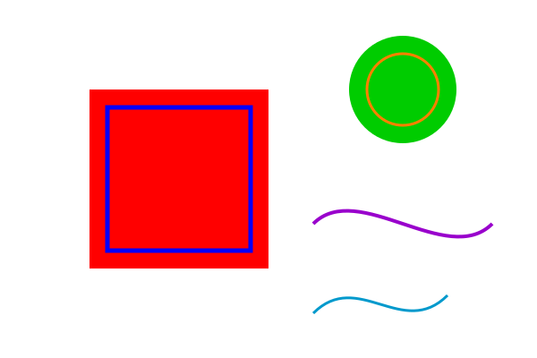
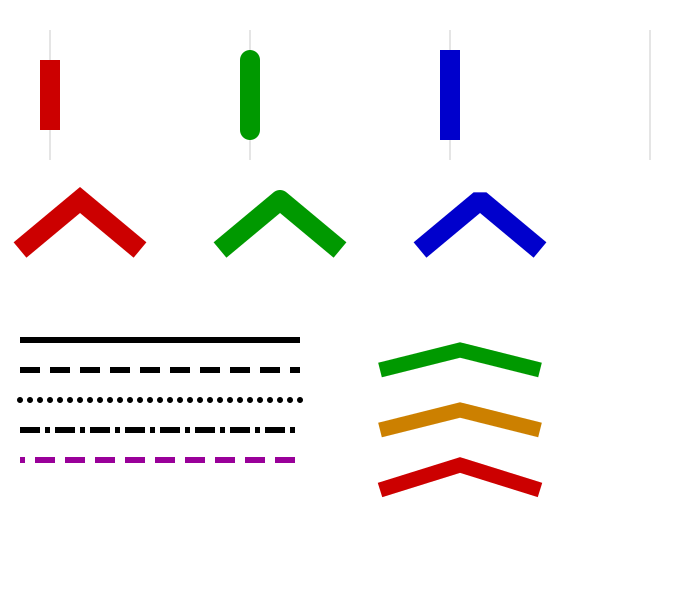
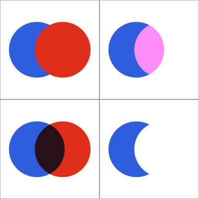
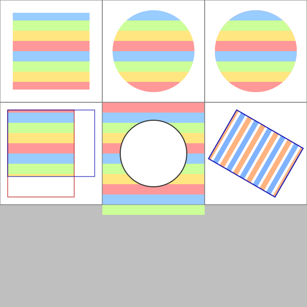
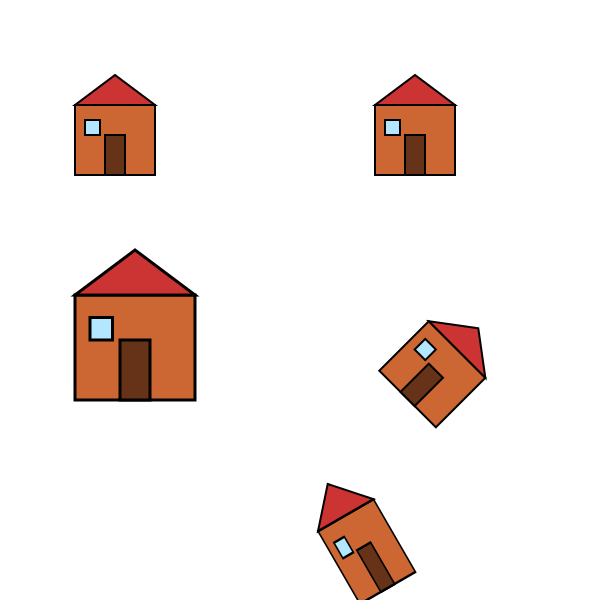
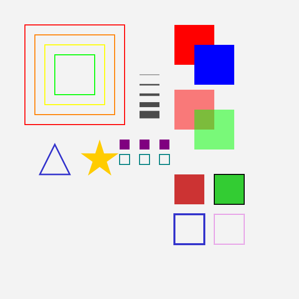

# Go-Cairo Examples

This directory contains working code examples demonstrating the go-cairo library's
capabilities. Each example is a standalone function that generates one or more output
files (PNG, PDF, or SVG).

## Building and Running

The examples live in the `examples` package and are not standalone programs. To run
an example, write a small `main.go` that calls the function you want:

```go
package main

import (
    "log"
    "github.com/mikowitz/cairo/examples"
)

func main() {
    if err := examples.GenerateBasicShapes("output.png"); err != nil {
        log.Fatal(err)
    }
}
```

Then run it:

```bash
go run main.go
```

To run the example tests (which verify every example compiles and produces valid
output):

```bash
# All examples
go test -race ./examples/...

# One example
go test -race ./examples/... -run TestBasicShapes

# With verbose output
go test -v ./examples/...
```

### Build Tags

Two examples require optional Cairo backends and are guarded by build tags:

| Build tag | Meaning |
|-----------|---------|
| `!nopdf`  | PDF surface requires `cairo-pdf` pkg-config |
| `!nosvg`  | SVG surface requires `cairo-svg` pkg-config |

By default both backends are enabled on macOS (Homebrew) and most Linux distributions.
To disable one, pass the appropriate tag:

```bash
go test -tags nopdf ./examples/...
```

---

## Examples

### basic_shapes.go

**Function:** `GenerateBasicShapes(outputPath string) error`
**Output:** 600×400 PNG

Demonstrates the core Cairo drawing workflow: creating surfaces and contexts, setting
colors, drawing filled and stroked rectangles, circles (using `Arc`), and Bézier
curves (`CurveTo`).

**Concepts:** `NewImageSurface`, `NewContext`, `SetSourceRGB`, `Rectangle`, `Arc`,
`CurveTo`, `Fill`, `Stroke`, `WriteToPNG`



---

### line_styles.go

**Function:** `GenerateLineStyles(outputPath string) error`
**Output:** 600×400 PNG

Shows all line cap styles (`LineCapButt`, `LineCapRound`, `LineCapSquare`), line join
styles (`LineJoinMiter`, `LineJoinRound`, `LineJoinBevel`), and various dash patterns
created with `SetDash`.

**Concepts:** `SetLineCap`, `SetLineJoin`, `SetLineWidth`, `SetDash`, `Stroke`



---

### fill_rules.go

**Function:** `GenerateFillRules(outputPath string) error`
**Output:** 600×400 PNG

Illustrates how `FillRuleWinding` and `FillRuleEvenOdd` differ when filling
self-intersecting paths such as a five-pointed star. Side-by-side comparison makes
the effect easy to see.

**Concepts:** `SetFillRule`, `FillRuleWinding`, `FillRuleEvenOdd`, `Fill`


---

### gradients.go

**Function:** `GenerateGradients(outputPath string) error`
**Output:** 600×600 PNG

Six panels demonstrating linear and radial gradients with different numbers of color
stops, including stops with alpha transparency.

**Concepts:** `NewLinearGradient`, `NewRadialGradient`, `AddColorStopRGB`,
`AddColorStopRGBA`, `SetSource`, `Pattern.Extend`


---

### patterns.go

**Function:** `GeneratePatterns(outputPath string) error`
**Output:** 600×600 PNG

Shows surface patterns used as texture sources, with all four extend modes
(`ExtendNone`, `ExtendRepeat`, `ExtendReflect`, `ExtendPad`) and the two filter modes
(`FilterNearest`, `FilterBilinear`).

**Concepts:** `NewSurfacePattern`, `SetExtend`, `SetFilter`, `SetSourceMatrix`


---

### compositing.go

**Function:** `GenerateCompositing(outputPath string) error`
**Output:** 600×600 PNG

Visual grid of all 29 Cairo compositing operators. Each cell draws two overlapping
shapes using a different `Operator` constant so you can see the compositing result
directly.

**Concepts:** `SetOperator`, all `Operator*` constants



---

### clipping.go

**Function:** `GenerateClipping(outputPath string) error`
**Output:** 600×400 PNG

Demonstrates rectangular clipping, circular clipping, nested clip regions,
`ClipPreserve`, and how `Save`/`Restore` isolate clip state so earlier regions are
restored correctly.

**Concepts:** `Clip`, `ClipPreserve`, `ResetClip`, `Save`, `Restore`



---

### transformations.go

**Function:** `GenerateTransformations(outputPath string) error`
**Output:** 600×600 PNG

Draws the same "house" shape five times using `Translate`, `Scale`, `Rotate`, and
combinations of all three. Shows how `Save`/`Restore` keep transformations isolated
between panels.

**Concepts:** `Translate`, `Scale`, `Rotate`, `Save`, `Restore`



---

### complex_shapes.go

**Function:** `GenerateComplexShapes(outputPath string) error`
**Output:** 600×600 PNG

A comprehensive showcase of most `Context` methods in a single image: state
management, color sources, path operations, fill/stroke variants, line properties, and
status checking.

**Concepts:** `Save`/`Restore`, `FillPreserve`, `StrokePreserve`, `NewPath`,
`NewSubPath`, `GetCurrentPoint`, `HasCurrentPoint`, `Status`



---

### text.go

**Function:** `GenerateText(outputPath string) error`
**Output:** 400×300 PNG

Shows Cairo's toy font API with five text rows rendered using different faces, sizes,
slants, and weights. The last row uses `TextPath` + `Fill` to render glyph outlines as
filled vector shapes.

**Concepts:** `SelectFontFace`, `SetFontSize`, `ShowText`, `TextPath`, `font.Slant`,
`font.Weight`

> Note: Text rendering is platform-dependent. The output image will look slightly
> different on macOS versus Linux due to font selection and antialiasing differences.

---

### text_extents.go

**Function:** `GenerateTextExtents(outputPath string) error`
**Output:** 500×400 PNG

Three sections demonstrating text measurement: left/center/right alignment computed
from `TextExtents`, multi-line spacing using `FontExtents.Height`, and an ink bounding
box drawn around a string using `XBearing`/`YBearing`/`Width`/`Height`.

**Concepts:** `TextExtents`, `FontExtents`, text alignment math

> Note: Uses structural tests rather than golden image comparison due to
> platform-dependent text rendering.

---

### dashboard.go + dashboard_pdf.go

**Functions:**
- `GenerateDashboard(outputPath string) error` → 800×600 PNG
- `GenerateDashboardPDF(outputPath string) error` → A4 landscape PDF (build tag `!nopdf`)

A polished data dashboard combining multiple advanced features in one image:

- Gradient header bar with title text
- **Bar chart** (upper-left): monthly sales bars with vertical gradient fills
- **Line chart** (upper-right): weekly trend with shaded area under the line and dot
  markers
- **Pie chart** (bottom): category split with radial-gradient slices and a text legend

The same `drawDashboard` helper is reused for both the PNG and PDF outputs,
demonstrating that Cairo drawing code is surface-agnostic.

**Concepts:** Linear and radial gradients, `Arc`, `TextExtents` for centering,
`Save`/`Restore`, `PDFSurface.ShowPage`

---

### animation.go

**Function:** `GenerateAnimation(outputDir string) error`
**Output:** 30 PNG frames (`frame_000.png` … `frame_029.png`) in `outputDir`

Generates a one-second animation at 30 fps by writing one PNG per frame. Each frame
shows a rotating white hexagon and an orange ball orbiting its center against a
dark-to-deep-blue gradient background.

The frames can be assembled into a video with:

```bash
ffmpeg -r 30 -i frame_%03d.png animation.mp4
```

**Concepts:** Frame loop, `Rotate`, `Save`/`Restore` for per-frame transforms,
memory management (each frame's surface is freed immediately after `WriteToPNG`)

---

### pdf_output.go

**Function:** `GeneratePDFOutput(outputPath string) error`
**Output:** 3-page US Letter PDF (build tag `!nopdf`)

A multi-page PDF demonstrating all major drawing features on vector output:

- Page 1: Basic shapes (rectangles, circle, arc, semi-transparent triangle)
- Page 2: Linear and radial gradients
- Page 3: Text with different fonts, `TextPath` vector outlines, centered text

**Concepts:** `NewPDFSurface`, `PDFSurface.ShowPage`, `PDFSurface.SetSize`

---

### svg_output.go

**Function:** `GenerateSVGOutput(outputPath string) error`
**Output:** 600×400pt SVG (build tag `!nosvg`)

A single-page SVG covering shapes, gradients, and text in a format suitable for
web use. The output is valid XML that can be embedded directly in HTML.

**Concepts:** `NewSVGSurface`, `SVGSurface.SetDocumentUnit`, `SVGUnit` constants

---

## Output Reference

Golden reference images for the geometry-only examples (no text) are stored in
`testdata/golden/`. These are used by the test suite for pixel-level comparison with
a small tolerance to accommodate sub-pixel antialiasing differences between platforms.

Text-rendering examples (`text`, `text_extents`, `dashboard`) use structural tests
instead of golden images because font selection and hinting differ too much between
operating systems to allow pixel comparison.
